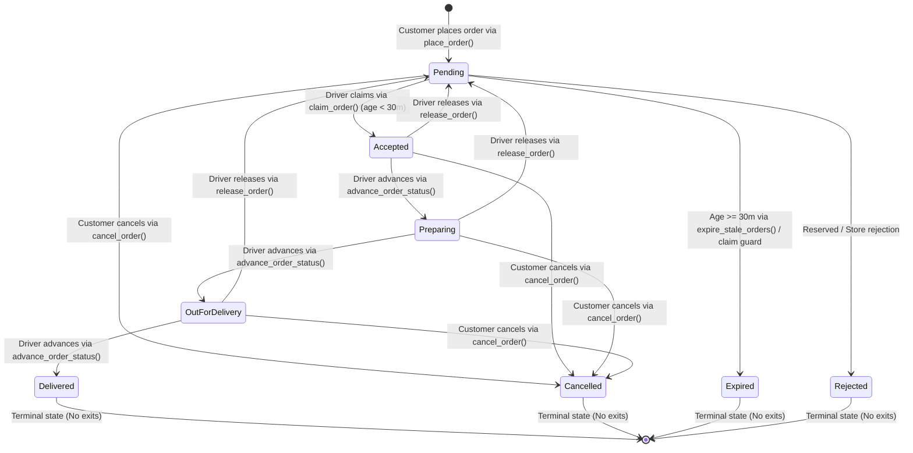

# Data Model: Order Cancellation & Expiration

**Feature**: `005-order-cancellation-expiration`  
**Date**: 2026-09-25  
**Status**: Completed  
**Spec Reference**: [spec.md](./spec.md) | **Research Reference**: [research.md](./research.md)

---

## 1. Entity Definitions & Schemas

### 1.1 `Order` (`public.orders`)

Represents the core commercial delivery transaction. Stores immutable snapshots taken at checkout time along with lifecycle tracking fields.

#### Attributes & Columns

| Column | PostgreSQL Type | Nullable | Default | Description |
|---|---|---|---|---|
| `id` | `UUID` | No | `gen_random_uuid()` | Primary key. Immutable. |
| `customer_id` | `UUID` | No | — | References `public.profiles(id)`. Immutable. |
| `driver_id` | `UUID` | Yes | `NULL` | References `public.profiles(id)`. Assigned driver. Mutable only via `claim_order` or `release_order`. Retained upon customer cancellation for audit and notification routing. |
| `restaurant_id` | `UUID` | No | — | References `public.restaurants(id)`. Immutable. |
| `restaurant_name` | `TEXT` | No | — | Immutable point-in-time snapshot of the store name. |
| `status` | `public.order_status` | No | `'pending'` | Current lifecycle status enum. Governed strictly by `validate_order_transition`. |
| `delivery_address` | `TEXT` | No | — | Immutable snapshot of customer street address. |
| `delivery_address_label` | `TEXT` | Yes | `NULL` | Immutable snapshot of address label (e.g. Home, Work). |
| `payment_method` | `public.payment_method` | No | `'cash_on_delivery'` | Payment mode snapshot. |
| `coupon_code` | `TEXT` | Yes | `NULL` | Applied coupon code snapshot. |
| `discount_amount` | `INTEGER` | No | `0` | Discount applied in piasters (cents). Immutable. |
| `subtotal_amount` | `INTEGER` | No | — | Sum of items + add-ons in piasters. Immutable. |
| `delivery_fee` | `INTEGER` | No | `0` | Delivery fee in piasters. Immutable. |
| `total_amount` | `INTEGER` | No | — | Final charged total in piasters. Immutable. |
| `event_seq` | `INTEGER` | No | `0` | Monotonically incremented sequence counter per row lock, driving notification deduplication. |
| `created_at` | `TIMESTAMPTZ` | No | `now()` | Order creation timestamp (server-authoritative). Basis for 30-minute expiration TTL. |
| `accepted_at` | `TIMESTAMPTZ` | Yes | `NULL` | Timestamp when driver claimed order. Set automatically by trigger. |
| `delivered_at` | `TIMESTAMPTZ` | Yes | `NULL` | Timestamp when order was delivered. Set automatically by trigger. |
| `updated_at` | `TIMESTAMPTZ` | No | `now()` | Timestamp of last modification. |
| `customer_hidden_at` | `TIMESTAMPTZ` | Yes | `NULL` | **New in 005**: Timestamp when customer hid order from their visible history. `NULL` indicates order is visible. |

#### Database Indexes & Constraints

- **Primary Key**: `orders_pkey` on `(id)`
- **Unique Partial Index**: `orders_one_active_delivery_per_driver_idx` on `(driver_id)` WHERE `status IN ('accepted', 'preparing', 'out_for_delivery')`
- **Customer History Index**: `idx_orders_customer_hidden` on `(customer_id, customer_hidden_at)` WHERE `customer_hidden_at IS NULL`
- **Customer Orders Index**: `idx_orders_customer_created` on `(customer_id, created_at DESC)`
- **Pending Orders Index**: `idx_orders_pending_pool` on `(created_at ASC)` WHERE `status = 'pending' AND driver_id IS NULL`

---

### 1.2 `order_status` Enum

PostgreSQL Enum governing allowed lifecycle values.

```sql
CREATE TYPE public.order_status AS ENUM (
  'pending',
  'accepted',
  'preparing',
  'out_for_delivery',
  'delivered',
  'cancelled',
  'rejected',
  'expired'   -- Added in Feature 005
);
```

#### Status Classification

| Status | Phase | Terminal? | Cancellable by Customer? | Driver Pool Visible? |
|---|---|---|---|---|
| `pending` | Unclaimed | No | Yes | Yes (if age < 30m) |
| `accepted` | Assigned / Driver En Route to Store | No | Yes | No |
| `preparing` | Store Preparing Order | No | Yes | No |
| `out_for_delivery` | Driver En Route to Customer | No | Yes | No |
| `delivered` | Completed Delivery | Yes | **No** | No |
| `cancelled` | Aborted by Customer | Yes | **No** | No |
| `rejected` | Reserved (Store Rejection) | Yes | **No** | No |
| `expired` | Timed Out (Unclaimed > 30m) | Yes | **No** | No |

---

### 1.3 `notification_events` Table

Audit log and durable enqueue mechanism for the push notification pipeline (Feature 004).

#### Schema & Attributes

| Column | Type | Nullable | Default | Description |
|---|---|---|---|---|
| `id` | `UUID` | No | `gen_random_uuid()` | Primary key. |
| `event_type` | `TEXT` | No | — | CHECK constraint updated in 005 to include `'order_cancelled_by_customer'` and `'order_expired'`. |
| `order_id` | `UUID` | No | — | References `public.orders(id)` ON DELETE CASCADE. |
| `target_role` | `TEXT` | No | — | CHECK `target_role IN ('customer', 'driver')`. |
| `title` | `TEXT` | No | — | Fallback title. |
| `body` | `TEXT` | No | — | Fallback body. |
| `deep_link_url` | `TEXT` | No | — | In-app navigation route (e.g. `/(customer)/orders/{id}` or `/(driver)/available-orders`). |
| `dispatch_status` | `TEXT` | No | `'pending'` | CHECK `('pending', 'processing', 'sent', 'failed')`. |
| `dedupe_key` | `TEXT` | No | — | UNIQUE constraint. Format: `{order_id}:{event_type}:{event_seq}`. |
| `expo_receipts` | `JSONB` | Yes | `NULL` | Delivery receipts and error notes from Expo Push API. |
| `created_at` | `TIMESTAMPTZ` | No | `now()` | Timestamp of enqueue. |

#### Updated Event Type Constraint

```sql
ALTER TABLE public.notification_events DROP CONSTRAINT IF EXISTS notification_events_event_type_check;
ALTER TABLE public.notification_events ADD CONSTRAINT notification_events_event_type_check
  CHECK (event_type IN (
    'new_order_pool',
    'order_accepted',
    'order_preparing',
    'order_out_for_delivery',
    'order_delivered',
    'order_cancelled',
    'order_released',
    'order_cancelled_by_customer',  -- New in 005 (Target: Driver)
    'order_expired'                 -- New in 005 (Target: Customer)
  ));
```

---

### 1.4 `driver_pool_signals` Table

PII-free signal table consumed by Supabase Realtime to broadcast pool invalidation to drivers.

#### Schema & Attributes

| Column | Type | Description |
|---|---|---|
| `id` | `UUID` | Primary key. |
| `order_id` | `UUID` | References `public.orders(id)` ON DELETE CASCADE. |
| `signal` | `TEXT` | CHECK `signal IN ('order_added', 'order_claimed', 'order_released')`. |
| `created_at` | `TIMESTAMPTZ` | Timestamp of signal. |

*Behavior in 005*: When a pending order transitions to `cancelled` or `expired`, `emit_driver_pool_signal()` writes an ephemeral `'order_claimed'` signal and purges stale signals for the order, prompting all listening driver apps to refetch the pool immediately.

---

## 2. Order Lifecycle State Machine



### Transition Authority Matrix

| Transition | Calling Mechanism | Authorization Check | Actor GUC | Notes |
|---|---|---|---|---|
| `pending -> accepted` | `claim_order(p_order_id, p_driver_id)` | Caller is driver, no active order, order age < 30m | `app.order_maintenance = 'on'` | Assigns driver, sets `accepted_at`. |
| `pending -> cancelled` | `cancel_order(p_order_id)` | Authenticated customer owns order (`customer_id = auth.uid()`) | `app.cancellation_actor = 'customer'` | Suppresses customer push notification. |
| `pending -> expired` | `expire_stale_orders()` or claim TTL | Scheduled background worker / server-authoritative | None | Triggers `order_expired` customer alert. |
| `accepted -> preparing` | `advance_order_status(p_order_id)` | Caller is assigned driver (`driver_id = auth.uid()`) | None | Atomic status check prevents race with cancel. |
| `accepted -> cancelled` | `cancel_order(p_order_id)` | Authenticated customer owns order (`customer_id = auth.uid()`) | `app.cancellation_actor = 'customer'` | Clears driver `current_order_id`, notifies driver. |
| `preparing -> out_for_delivery` | `advance_order_status(p_order_id)` | Caller is assigned driver (`driver_id = auth.uid()`) | None | Atomic status check prevents race with cancel. |
| `preparing -> cancelled` | `cancel_order(p_order_id)` | Authenticated customer owns order (`customer_id = auth.uid()`) | `app.cancellation_actor = 'customer'` | Clears driver `current_order_id`, notifies driver. |
| `out_for_delivery -> delivered` | `advance_order_status(p_order_id)` | Caller is assigned driver (`driver_id = auth.uid()`) | None | Sets `delivered_at`, clears driver `current_order_id`. |
| `out_for_delivery -> cancelled` | `cancel_order(p_order_id)` | Authenticated customer owns order (`customer_id = auth.uid()`) | `app.cancellation_actor = 'customer'` | Allowed by explicit business decision. |
| `active -> pending` | `release_order(p_order_id, p_reason)` | Caller is assigned driver, reason required | `app.order_maintenance = 'on'` | Clears `driver_id`, logs interaction in `doi`. |

---

## 3. Client Domain Models (`src/features/orders/domain/entities`)

### 3.1 `OrderStatus.ts`

```typescript
export enum OrderStatus {
  Pending = 'pending',
  Accepted = 'accepted',
  Preparing = 'preparing',
  OutForDelivery = 'out_for_delivery',
  Delivered = 'delivered',
  Cancelled = 'cancelled',
  Rejected = 'rejected',
  Expired = 'expired', // Added in Feature 005
}

/**
 * Valid status transitions matching the database validate_order_transition trigger 1:1.
 */
export const VALID_TRANSITIONS: Record<OrderStatus, OrderStatus[]> = {
  [OrderStatus.Pending]: [
    OrderStatus.Accepted,
    OrderStatus.Cancelled,
    OrderStatus.Rejected,
    OrderStatus.Expired,
  ],
  [OrderStatus.Accepted]: [OrderStatus.Preparing, OrderStatus.Cancelled],
  [OrderStatus.Preparing]: [OrderStatus.OutForDelivery, OrderStatus.Cancelled],
  [OrderStatus.OutForDelivery]: [OrderStatus.Delivered, OrderStatus.Cancelled],
  [OrderStatus.Delivered]: [],
  [OrderStatus.Cancelled]: [],
  [OrderStatus.Rejected]: [],
  [OrderStatus.Expired]: [],
};

export function canTransitionTo(from: OrderStatus, to: OrderStatus): boolean {
  return VALID_TRANSITIONS[from]?.includes(to) ?? false;
}

export function isTerminalStatus(status: OrderStatus): boolean {
  return VALID_TRANSITIONS[status]?.length === 0;
}
```

### 3.2 `Order.ts`

```typescript
export interface Order {
  id: string;
  customerId: string;
  driverId: string | null;
  storeId: string;
  storeName: string;
  status: OrderStatus;
  deliveryAddressSnapshot: string;
  deliveryAddressLabel: string | null;
  paymentMethod: PaymentMethod;
  couponCode: string | null;
  discountAmount: MoneyAmount;
  subtotalAmount: MoneyAmount;
  deliveryFee: MoneyAmount;
  totalAmount: MoneyAmount;
  items: OrderItemSnapshot[];
  createdAt: string;
  acceptedAt: string | null;
  deliveredAt: string | null;
  updatedAt: string;
  customerHiddenAt: string | null; // Added in Feature 005
}
```

### 3.3 `NotificationEventType.ts`

```typescript
export enum NotificationEventType {
  NewOrderPool = 'new_order_pool',
  OrderAccepted = 'order_accepted',
  OrderPreparing = 'order_preparing',
  OrderOutForDelivery = 'order_out_for_delivery',
  OrderDelivered = 'order_delivered',
  OrderCancelled = 'order_cancelled',
  OrderReleased = 'order_released',
  OrderCancelledByCustomer = 'order_cancelled_by_customer', // Added in Feature 005
  OrderExpired = 'order_expired',                             // Added in Feature 005
}
```

---

## 4. Reorder ("Order Again") Staging Model

When reordering from past orders:

```typescript
export interface ReorderItemValidation {
  productId: string;
  productName: string;
  requestedQuantity: number;
  available: boolean;
  currentUnitPrice: number;
  selectedAddOns: {
    addonId: string;
    name: string;
    available: boolean;
    currentUnitPrice: number;
  }[];
  omittedReason?: 'product_unavailable' | 'store_closed' | 'addon_unavailable';
}

export interface ReorderResult {
  storeId: string;
  storeName: string;
  validItems: CartItem[];
  omittedItemsCount: number;
  hasStoreConflict: boolean;
}
```
