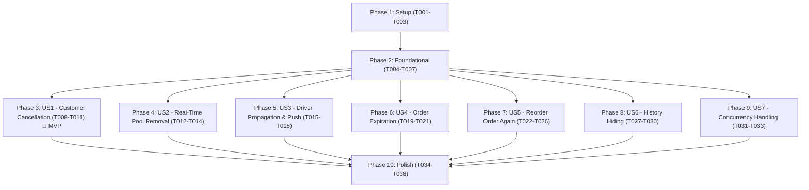

# Tasks: Order Cancellation & Expiration

**Feature**: `005-order-cancellation-expiration`  
**Input**: Design documents from `specs/005-order-cancellation-expiration/` (`spec.md`, `plan.md`, `data-model.md`, `contracts/`, `research.md`, `quickstart.md`)  
**Constitution**: `.specify/memory/constitution.md` (v1.1.0)  
**Tests**: Verification via runnable scenarios in `quickstart.md` + SQL adversarial checks + `npx tsc --noEmit` & `npm run lint`

---

## Format: `- [ ] [TaskID] [P?] [Story?] Description with file path`

- **[P]**: Can run in parallel (different files, no dependencies)
- **[Story]**: Which user story the task belongs to (`[US1]` through `[US7]`). Absent in Setup, Foundational, and Polish phases.
- Exact file paths included in every task description.

---

## Phase 1: Setup (Shared Infrastructure)

**Purpose**: Initial schema types and domain entity foundation.

- [x] T001 Create migration `supabase/migrations/20260925000001_add_expired_order_status.sql` adding value `'expired'` to enum `public.order_status` via `ALTER TYPE public.order_status ADD VALUE IF NOT EXISTS 'expired';`
- [x] T002 [P] Extend domain entities in `src/features/orders/domain/entities/OrderStatus.ts` (add `OrderStatus.Expired = 'expired'` and update `VALID_TRANSITIONS` with 1:1 trigger parity) and `src/features/orders/domain/entities/Order.ts` (add `customerHiddenAt: string | null`)
- [x] T003 [P] Extend notification domain entity `src/features/notifications/domain/entities/NotificationEventType.ts` adding enum members `OrderCancelledByCustomer = 'order_cancelled_by_customer'` and `OrderExpired = 'order_expired'`

---

## Phase 2: Foundational (Blocking Prerequisites)

**Purpose**: Core database schema alterations, triggers, RPCs, and repository contracts. MUST complete before ANY user story can begin.

**⚠️ CRITICAL**: No user story work can begin until this phase is complete.

- [x] T004 Create migration `supabase/migrations/20260925000002_order_cancellation_expiration.sql`:
  - Add column `customer_hidden_at TIMESTAMPTZ DEFAULT NULL` to `public.orders` and index `idx_orders_customer_hidden ON public.orders(customer_id, customer_hidden_at) WHERE customer_hidden_at IS NULL`
  - Update `notification_events.event_type` check constraint to include `'order_cancelled_by_customer'` and `'order_expired'`
  - Update `validate_order_transition()` trigger to allow transitions `pending -> (accepted, cancelled, rejected, expired)`, `accepted -> (preparing, cancelled)`, `preparing -> (out_for_delivery, cancelled)`, `out_for_delivery -> (delivered, cancelled)`
  - Create `pending_order_ttl()` returning `interval '30 minutes'`
  - Update `claim_order(p_order_id, p_driver_id)` with atomic expiration check `AND created_at >= (now() - public.pending_order_ttl())`
  - Update `get_available_orders()` query with `AND o.created_at >= (now() - public.pending_order_ttl())`
  - Update `emit_driver_pool_signal()` trigger to include `'expired'` in pool exit conditions
  - Update `enqueue_order_notification()` trigger with actor-aware cancellation check (`app.cancellation_actor = 'customer'`) and `order_expired` event emission
  - Create `cancel_order(p_order_id UUID)` RPC (`SECURITY DEFINER`)
  - Create `expire_stale_orders()` RPC (`SECURITY DEFINER`)
  - Create `hide_order(p_order_id UUID)` RPC (`SECURITY DEFINER`)
  - Update `advance_order_status(p_order_id UUID)` RPC with `AND status = v_current_status` guard to prevent unhandled trigger exceptions on concurrent cancellation
  - Update `get_driver_history()` to union orders where `o.driver_id = auth.uid() AND o.status = 'cancelled'` so cancelled active deliveries appear in the assigned driver's history
  - Drop legacy policy `DROP POLICY IF EXISTS orders_update_own_customer_cancel ON public.orders;`
  - Register `pg_cron` schedule `expire_stale_orders_job` every minute
- [x] T005 Apply migrations to database via `npx supabase migration up` and verify tables, triggers, and functions
- [x] T006 [P] Update domain repository interface `src/features/orders/domain/repositories/OrderRepository.ts` to add `cancelOrder(orderId: string): Promise<Order>` and `hideOrder(orderId: string): Promise<void>`
- [x] T007 Implement `cancelOrder`, `hideOrder`, and filter `customer_hidden_at IS NULL` in `getCustomerOrders` in `src/features/orders/infrastructure/SupabaseOrderRepository.ts`

**Checkpoint**: Foundation ready — database schema, triggers, RPCs, and base repositories are operational. User story implementations can now begin.

---

## Phase 3: User Story 1 - Customer Self-Service Order Cancellation (Priority: P1) 🎯 MVP

**Goal**: Authenticated customers can cancel their own orders while in `pending`, `accepted`, `preparing`, or `out_for_delivery` states; cancellations after `delivered`, `cancelled`, or `expired` are strictly rejected.

**Independent Test**: Quickstart Scenario 1 — Place an order, advance through each pre-delivery state, cancel successfully, and verify rejection once delivered.

### Implementation for User Story 1

- [x] T008 [US1] Create cancellation confirmation dialog and action button in `src/app/(customer)/orders/[id].tsx` visible for `pending`, `accepted`, `preparing`, and `out_for_delivery` statuses
- [x] T009 [US1] Wire `cancelOrder` mutation with TanStack Query cache invalidation (`['order', orderId]`, `['orders', customerId]`) in `src/app/(customer)/orders/[id].tsx`
- [x] T010 [US1] Update `src/features/orders/presentation/OrderSummaryCard.tsx` to render the `cancelled` status badge cleanly
- [ ] T011 [US1] Validate User Story 1 independently via Quickstart Scenario 1

**Checkpoint**: User Story 1 (MVP) is fully functional and testable independently.

---

## Phase 4: User Story 2 - Real-Time Pool Removal on Cancellation & Expiration (Priority: P1)

**Goal**: Unclaimed orders that are cancelled or expired disappear from the Driver Available Orders pool in real time (< 1s) across connected driver devices.

**Independent Test**: Quickstart Scenario 2 — Open driver available orders on Device A, cancel a pending order on Device B, verify instant removal on Device A without refreshing.

### Implementation for User Story 2

- [x] T012 [US2] Verify `emit_driver_pool_signal` trigger emits `'order_claimed'` and purges stale signals for cancelled and expired orders in `supabase/migrations/20260925000002_order_cancellation_expiration.sql`
- [x] T013 [US2] Ensure driver pool subscription in `src/features/drivers/infrastructure/SupabaseDriverRealtimeService.ts` and `src/features/drivers/application/hooks/useAvailableOrders.ts` triggers immediate query invalidation upon pool signals
- [ ] T014 [US2] Validate User Story 2 independently via Quickstart Scenario 2

**Checkpoint**: User Stories 1 AND 2 work independently. Real-time driver pool updates immediately on cancellations and expirations.

---

## Phase 5: User Story 3 - Active Driver Cancellation Propagation & Push Alert (Priority: P1)

**Goal**: When a customer cancels an active claimed order, the assigned driver is alerted in real time with an in-app notice, their capacity is instantly freed, they receive an `order_cancelled_by_customer` push notification, and the customer receives no self-echo push alert.

**Independent Test**: Quickstart Scenario 3 — Driver claims order, customer cancels; driver sees "Customer cancelled this order", advance is disabled, driver can immediately claim new order, driver receives push notification, customer receives 0 push notifications.

### Implementation for User Story 3

- [x] T015 [US3] Update Edge Function `supabase/functions/notify-order-status/index.ts` to:
  - Select `driver_id` in the `orders` query: `.select('id, customer_id, driver_id, restaurant_id, restaurant_name, total_amount')`
  - Add targeted driver resolution for `event_type === 'order_cancelled_by_customer'`: dispatch only to `device_push_tokens` for `user_id = order.driver_id`
  - Add English ("The customer cancelled your order from {restaurant_name}") and Arabic ("قام العميل بإلغاء طلبك من {restaurant_name}") copy templates
- [x] T016 [US3] Update `src/features/drivers/presentation/components/ActiveOrderCard.tsx`: detect `activeOrder.status === 'cancelled'`, render prominent warning notice `"Customer cancelled this order"`, disable status advance actions, and show a `"Return to Available Orders"` recovery button
- [x] T017 [US3] Update `src/app/(driver)/active-order.tsx` to handle cancelled active orders smoothly and navigate back to available orders upon user acknowledgement
- [ ] T018 [US3] Validate User Story 3 independently via Quickstart Scenario 3 (verify active order notice, capacity release, driver push notification, customer self-echo suppression, and cancelled delivery appearance in driver history)

**Checkpoint**: User Story 3 complete. Assigned drivers receive in-app notice, push alert, and immediate capacity release on customer cancellation; no customer self-echo.

---

## Phase 6: User Story 4 - Automatic Expiration of Stale Pending Orders (Priority: P1)

**Goal**: Unclaimed orders pending for > 30 minutes automatically transition to `expired`, trigger customer `order_expired` push notifications, exit the driver pool, and atomically reject concurrent claims.

**Independent Test**: Quickstart Scenario 4 — Simulate order with created_at 31 minutes ago; driver claim attempt fails; expiration worker sets status to `expired`; customer receives push alert.

### Implementation for User Story 4

- [x] T019 [US4] Update Edge Function `supabase/functions/notify-order-status/index.ts` with `order_expired` customer copy templates: English: `"Your order from {restaurant_name} expired as no driver was available"`, Arabic: `"انتهت صلاحية طلبك من {restaurant_name} لعدم توفر سائق"`
- [x] T020 [US4] Update `src/app/(customer)/orders/[id].tsx` and `src/features/orders/presentation/OrderSummaryCard.tsx` to display distinct "Expired" status badge and timeout explanation
- [ ] T021 [US4] Validate User Story 4 independently via Quickstart Scenario 4

**Checkpoint**: User Story 4 complete. 30-minute expiration is server-authoritative, automated via cron, and race-free.

---

## Phase 7: User Story 5 - Reorder from Expired or Past Orders ("Order Again") (Priority: P2)

**Goal**: Customers can tap "Order Again" on past orders (expired, cancelled, delivered) to revalidate current menu availability and prices, handle single-store conflicts via Redux, and stage items for explicit checkout confirmation.

**Independent Test**: Quickstart Scenario 5 — Tap "Order Again" on an expired order; verify catalog price revalidation; verify conflict prompt if cart has items from another store; confirm checkout navigation with explicit placement.

### Implementation for User Story 5

- [x] T022 [P] [US5] Extend `src/features/cart/application/cartSlice.ts` to support multi-item staging: add `clearAndSetBatch(payload: { storeId: string; storeName: string; items: CartItem[] })` and `setConflictBatchPrompt` reducers
- [x] T023 [US5] Update `src/features/cart/presentation/StoreConflictModal.tsx` to support batch reorder conflict confirmation and replacement
- [x] T024 [US5] Implement `src/features/orders/application/hooks/useReorder.ts`:
  - Fetch live products and add-ons via `ProductRepository` and store status via `StoreRepository`
  - Revalidate product existence and `is_available` flag; recompute unit prices with current live prices
  - If any items or add-ons are discontinued/unavailable, alert customer via an in-app Alert dialog detailing omitted items
  - Check current cart store: if conflict, trigger `setConflictBatchPrompt`; if clean, stage items into cart
  - Navigate customer to `/(customer)/checkout` for explicit order confirmation
- [x] T025 [US5] Add "Order Again" button to order details `src/app/(customer)/orders/[id].tsx` and `src/features/orders/presentation/OrderSummaryCard.tsx` for terminal orders (`expired`, `cancelled`, `delivered`)
- [ ] T026 [US5] Validate User Story 5 independently via Quickstart Scenario 5

**Checkpoint**: User Story 5 complete. Reorder accurately reflects live prices, respects single-store rules, and never auto-places orders.

---

## Phase 8: User Story 6 - Customer Order History Hiding (Priority: P2)

**Goal**: Customers can soft-hide past orders from their visible history list; database records, snapshots, and financial audit trails remain completely unaltered.

**Independent Test**: Quickstart Scenario 6 — Hide an order from history; verify removal from list; verify database row exists with `customer_hidden_at` set; verify direct link and "Order Again" remain functional.

### Implementation for User Story 6

- [x] T027 [US6] Add "Hide Order" / "Remove from History" action button and confirmation modal to `src/features/orders/presentation/OrderSummaryCard.tsx` and `src/app/(customer)/orders/[id].tsx`
- [x] T028 [US6] Wire `hideOrder` mutation in `src/app/(customer)/orders/index.tsx` to call `orderRepository.hideOrder` and invalidate `['orders', customerId]` query cache
- [x] T029 [US6] Ensure `getOrderById` in `src/features/orders/infrastructure/SupabaseOrderRepository.ts` and `src/app/(customer)/orders/[id].tsx` allows viewing hidden orders via deep links
- [ ] T030 [US6] Validate User Story 6 independently via Quickstart Scenario 6

**Checkpoint**: User Story 6 complete. Soft-hiding gives user control without compromising financial or operational audit logs.

---

## Phase 9: User Story 7 - Resilient Concurrent Advancement Handling (Priority: P3)

**Goal**: Interleaved customer cancellation and driver status advancement produces a graceful in-app resolution rather than an unhandled database exception dialog.

**Independent Test**: Quickstart Scenario 7 — Simulate concurrent driver status advance and customer cancellation; driver app handles response cleanly without SQL error dialog.

### Implementation for User Story 7

- [x] T031 [US7] Update `advanceOrderStatus` in `src/features/drivers/domain/repositories/DriverFulfillmentRepository.ts` and `src/features/drivers/infrastructure/SupabaseDriverFulfillmentRepository.ts` to return `AdvanceOrderResult` `{ success: boolean; newStatus?: string; error?: string; message?: string }`
- [x] T032 [US7] Update `useActiveOrder` hook in `src/features/drivers/application/hooks/useActiveOrder.ts`: if `advanceOrderStatus` returns `ORDER_STATUS_CHANGED`, invalidate `ACTIVE_ORDER_QUERY_KEY` and inform driver gracefully
- [ ] T033 [US7] Validate User Story 7 independently via Quickstart Scenario 7

**Checkpoint**: User Story 7 complete. High-concurrency races handle cleanly and gracefully.

---

## Phase 10: Polish & Cross-Cutting Concerns

**Purpose**: Type safety, linting, regression validation across all stories.

- [x] T034 [P] Run TypeScript strict type verification across the entire project with `npx tsc --noEmit`
- [x] T035 [P] Run Expo linting with `npm run lint`
- [ ] T036 Execute full end-to-end regression validation following `quickstart.md` scenarios 1 through 7

---

## Dependencies & Execution Order

### Phase Dependencies



### User Story Dependencies

- **User Story 1 (P1 - MVP)**: Depends only on Foundational (Phase 2).
- **User Story 2 (P1)**: Depends on Foundational (Phase 2). Employs pool exit triggers from US1/US4.
- **User Story 3 (P1)**: Depends on Foundational (Phase 2) and US1 cancellation trigger.
- **User Story 4 (P1)**: Depends on Foundational (Phase 2).
- **User Story 5 (P2)**: Depends on Foundational (Phase 2). Can execute in parallel with US1-US4.
- **User Story 6 (P2)**: Depends on Foundational (Phase 2). Can execute in parallel with US1-US5.
- **User Story 7 (P3)**: Depends on Foundational (Phase 2) and US3 driver UI.

---

## Parallel Opportunities

### Parallel Setup & Foundational Tasks
```bash
# Phase 1 parallel:
Task T002: "Extend domain entities in OrderStatus.ts and Order.ts"
Task T003: "Extend notification domain entity NotificationEventType.ts"

# Phase 2 parallel:
Task T006: "Update domain repository interface OrderRepository.ts"
```

### Parallel Story Execution (Multi-Developer Strategy)
```bash
# After Phase 2 completes, user story tracks can proceed concurrently:
Developer A: US1 (Customer Cancellation UI & Hooks) + US3 (Driver Propagation)
Developer B: US2 (Real-Time Pool Removal) + US4 (Automated Expiration)
Developer C: US5 (Reorder "Order Again" & Cart Staging) + US6 (History Hiding)
```

---

## Implementation Strategy

### MVP First (User Story 1)
1. Complete **Phase 1: Setup** (T001-T003)
2. Complete **Phase 2: Foundational** (T004-T007)
3. Implement **Phase 3: User Story 1** (T008-T011)
4. **VALIDATE MVP**: Run Quickstart Scenario 1. Customer self-service cancellation works end-to-end.

### Incremental Feature Delivery
1. Add **US2 & US4**: Driver pool exit and 30-minute automated order expiration.
2. Add **US3 & US7**: Driver in-app cancellation notice, capacity clearing, push alerts, and concurrency race protection.
3. Add **US5 & US6**: Reorder ("Order Again") with catalog revalidation and customer order history soft-hiding.
4. Run **Phase 10: Polish** (T034-T036) for full project verification.
