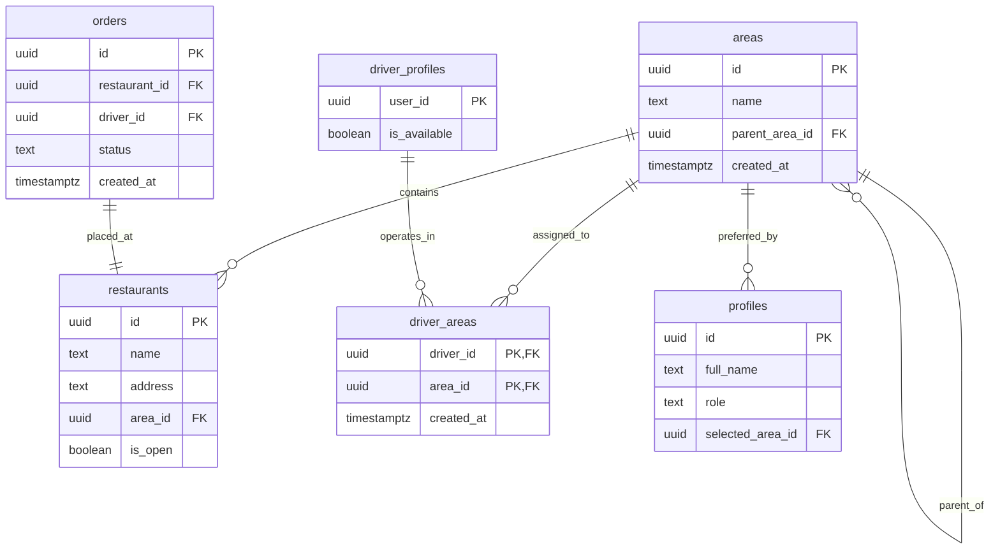

# Data Model: Regional Order Dispatch & Store Browsing

**Feature Branch**: `006-regional-order-dispatch`  
**Date**: 2026-09-26  
**Spec**: [spec.md](./spec.md) | **Research**: [research.md](./research.md)

---

## 1. Relational Entities (PostgreSQL Schema)



---

## 2. Table Specifications

### 2.1 `public.areas`
Represents geographic administrative regions in an adjacency-list tree.

| Column | Type | Constraints | Description |
|---|---|---|---|
| `id` | `UUID` | `PRIMARY KEY DEFAULT gen_random_uuid()` | Unique area identifier |
| `name` | `TEXT` | `NOT NULL` | Human-readable name (e.g., "Fayoum", "Senours") |
| `parent_area_id` | `UUID` | `NULLABLE, REFERENCES public.areas(id) ON DELETE RESTRICT` | Self-referencing link to parent area (NULL for top-level governorates) |
| `created_at` | `TIMESTAMPTZ` | `NOT NULL DEFAULT now()` | Row creation timestamp |

**Indexes**:
- `CREATE INDEX idx_areas_parent_area_id ON public.areas(parent_area_id);`

**RLS Policies**:
- `areas_public_select`: `FOR SELECT TO anon, authenticated USING (true);`
- Client mutations (`INSERT`, `UPDATE`, `DELETE`) are disallowed (no policies defined).

---

### 2.2 `public.driver_areas`
Junction table linking drivers to the specific areas they are authorized to serve.

| Column | Type | Constraints | Description |
|---|---|---|---|
| `driver_id` | `UUID` | `NOT NULL, REFERENCES public.driver_profiles(user_id) ON DELETE CASCADE` | Assigned driver |
| `area_id` | `UUID` | `NOT NULL, REFERENCES public.areas(id) ON DELETE RESTRICT` | Operational area |
| `created_at` | `TIMESTAMPTZ` | `NOT NULL DEFAULT now()` | Assignment timestamp |

**Primary Key**:
- `PRIMARY KEY (driver_id, area_id)`

**Indexes**:
- `CREATE INDEX idx_driver_areas_area_id ON public.driver_areas(area_id);`
- `CREATE INDEX idx_driver_areas_driver_id ON public.driver_areas(driver_id);`

**RLS Policies**:
- `driver_areas_driver_select`: `FOR SELECT TO authenticated USING (driver_id = auth.uid());`
- Client mutations (`INSERT`, `UPDATE`, `DELETE`) are disallowed.

---

### 2.3 `public.restaurants` (Altered)
Associates every store with exactly one specific physical area.

| Column Added | Type | Constraints | Description |
|---|---|---|---|
| `area_id` | `UUID` | `NOT NULL, REFERENCES public.areas(id) ON DELETE RESTRICT` | The area where the restaurant or market is located |

**Indexes**:
- `CREATE INDEX idx_restaurants_area_id ON public.restaurants(area_id);`

**Integrity & Backfill**:
- Added initially as nullable, backfilled from existing seed records to the Fayoum seed area ID, then altered to `SET NOT NULL`.

---

### 2.4 `public.profiles` (Altered)
Stores the customer's last chosen area preference across sessions and devices.

| Column Added | Type | Constraints | Description |
|---|---|---|---|
| `selected_area_id` | `UUID` | `NULLABLE, REFERENCES public.areas(id) ON DELETE SET NULL` | Persisted preferred browsing area for authenticated customers |

**Indexes**:
- `CREATE INDEX idx_profiles_selected_area_id ON public.profiles(selected_area_id);`

---

## 3. Database Functions & Procedures

### 3.1 `get_available_orders()` (Updated)
Adds server-side driver area enforcement to the available order pool:

```sql
CREATE OR REPLACE FUNCTION public.get_available_orders()
RETURNS JSONB
LANGUAGE plpgsql
STABLE
SECURITY DEFINER
SET search_path = public, auth, pg_temp
AS $function$
DECLARE
  v_pool JSONB;
BEGIN
  IF auth.uid() IS NULL THEN
    RAISE EXCEPTION 'NOT_AUTHENTICATED' USING ERRCODE = '42501';
  END IF;

  IF NOT app_private.has_role('driver') THEN
    RAISE EXCEPTION 'ONLY_DRIVERS_CAN_VIEW_ORDER_POOL' USING ERRCODE = '42501';
  END IF;

  IF NOT EXISTS (
    SELECT 1 FROM public.driver_profiles
    WHERE user_id = auth.uid() AND is_available = true
  ) THEN
    RETURN '[]'::jsonb;
  END IF;

  IF EXISTS (
    SELECT 1 FROM public.orders
    WHERE driver_id = auth.uid()
      AND status IN ('accepted', 'preparing', 'out_for_delivery')
  ) THEN
    RETURN '[]'::jsonb;
  END IF;

  SELECT coalesce(
           jsonb_agg(
             jsonb_build_object(
               'id', o.id,
               'storeName', o.restaurant_name,
               'storeNeighbourhood', r.address,
               'itemCount', (SELECT COUNT(*)::int FROM public.order_items oi WHERE oi.order_id = o.id),
               'createdAt', o.created_at
             ) ORDER BY o.created_at ASC
           ),
           '[]'::jsonb
         )
    INTO v_pool
    FROM public.orders o
    JOIN public.restaurants r ON r.id = o.restaurant_id
   WHERE o.status = 'pending'
     AND o.driver_id IS NULL
     AND o.created_at >= (now() - pending_order_ttl())
     AND NOT EXISTS (
       SELECT 1 FROM public.driver_order_interactions doi
       WHERE doi.driver_id = auth.uid()
         AND doi.order_id = o.id
         AND doi.interaction_type = 'declined'
     )
     -- Server-side regional dispatch filter (safe-default-deny)
     AND EXISTS (
       SELECT 1 FROM public.driver_areas da
       WHERE da.driver_id = auth.uid()
         AND da.area_id = r.area_id
     );

  RETURN v_pool;
END;
$function$;
```

---

## 4. TypeScript Domain Entities & State Models

### 4.1 Area Entity (`src/features/areas/domain/entities/Area.ts`)
```typescript
export interface Area {
  id: string;
  name: string;
  parentAreaId: string | null;
  createdAt: string;
}
```

### 4.2 Area Repository Contract (`src/features/areas/domain/repositories/AreaRepository.ts`)
```typescript
export interface AreaRepository {
  getAreas(): Promise<Area[]>;
}
```

### 4.3 Redux Area State (`src/features/areas/application/areaSlice.ts`)
```typescript
export interface AreaState {
  selectedAreaId: string | null;
  selectedAreaName: string | null;
}
```

### 4.4 Updated Store Entity & Repository (`src/features/restaurants/`)
```typescript
// Store.ts
export interface Store {
  id: string;
  name: string;
  type: StoreType;
  description: string | null;
  imageUrl: string | null;
  address: string;
  areaId: string; // Added
  rating: number | null;
  isOpen: boolean;
  createdAt: string;
}

// StoreRepository.ts
export interface StoreRepository {
  getStores(type?: StoreType, areaId?: string): Promise<Store[]>;
  getStoreById(id: string): Promise<Store>;
  getCategoriesByStoreId(storeId: string): Promise<StoreCategory[]>;
}
```

### 4.5 Updated UserProfile Entity (`src/features/profile/domain/entities/UserProfile.ts`)
```typescript
export interface UserProfile {
  id: string;
  fullName: string;
  role: UserRole;
  phone: string | null;
  avatarUrl: string | null;
  selectedAreaId: string | null; // Added
  createdAt: string;
  updatedAt: string;
}
```

---

## 5. Seed Data & Backfill Definitions

### 5.1 Seed Areas
```sql
INSERT INTO public.areas (id, name, parent_area_id) VALUES
  ('20000000-0000-0000-0000-000000000001', 'Fayoum', NULL),
  ('20000000-0000-0000-0000-000000000002', 'Senours', '20000000-0000-0000-0000-000000000001'),
  ('20000000-0000-0000-0000-000000000003', 'Itsa', '20000000-0000-0000-0000-000000000001')
ON CONFLICT (id) DO NOTHING;
```

### 5.2 Restaurant Backfill
```sql
-- Assign all existing seeded restaurants to Fayoum
UPDATE public.restaurants
   SET area_id = '20000000-0000-0000-0000-000000000001'
 WHERE area_id IS NULL;
```

### 5.3 Test Driver Seeding
```sql
-- Seed test driver assignments for Fayoum region
INSERT INTO public.driver_areas (driver_id, area_id)
SELECT p.id, '20000000-0000-0000-0000-000000000001'
  FROM public.profiles p
 WHERE p.role = 'driver'
ON CONFLICT (driver_id, area_id) DO NOTHING;
```
